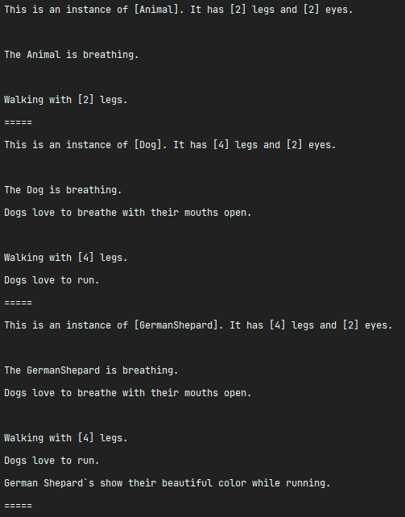

# 02.10 - 01. Java OOP Concepts - Animal Reign

In this exercise we will check how inheritance in Java and the usage of the **_super()_** and **_final_** keywords work.

### Overview of Animal.java:
- The **_Animal_** class represents an ordinary animal. It contains the _**numberOfLegs**_ and the **_numberOfEyes_** 
of an animal, as well as some of its behavior through the methods **_breathe()_** and **_walk()_**.
It also contains the **final method _summary()_**, which just summarizes the information of the current animal 
instance. As it is a final method, you **won't** be able to **override** it.
- No extra action should be taken here.

### Overview of Dog.java:
- Since every dog has 4 legs and two eyes, you should have a **default constructor** that makes a call to the 
  **Animal** constructor, passing the correspondent values to the constructor.
- You should override the **_breathe()_** method. It should call the **_breathe()_** method of the Animal class and 
  then print `"Dogs love to breathe with their mouths open."`.
- You should make the overridden **_breathe()_** method in the Dog class **_final_**. No other type of dog that 
  inherits from this class should breathe differently.
- You should override the **_walk()_** method. It should call the **_walk()_** method of the Animal class and then 
  print `"Dogs love to run."`.

### Overview of GermanShepard.java:
- You should override the **_walk()_** method. It should call the **_walk()_** method of the Dog class and then
  print ``"German Shepard`s show their beautiful fur while running."``.
- You should try to override the **_breathe()_** method from the Dog class here. You should get an error, since the 
  **_breathe()_** method is final and cannot be overridden anymore.

### Overview of AnimalReign.java:
- Where the main method resides, therefore where your code should be executed. An animal (human), a dog and a german 
  shepard instances are created. 
- No extra action should be taken here.

You should have an output similar to the one below:

